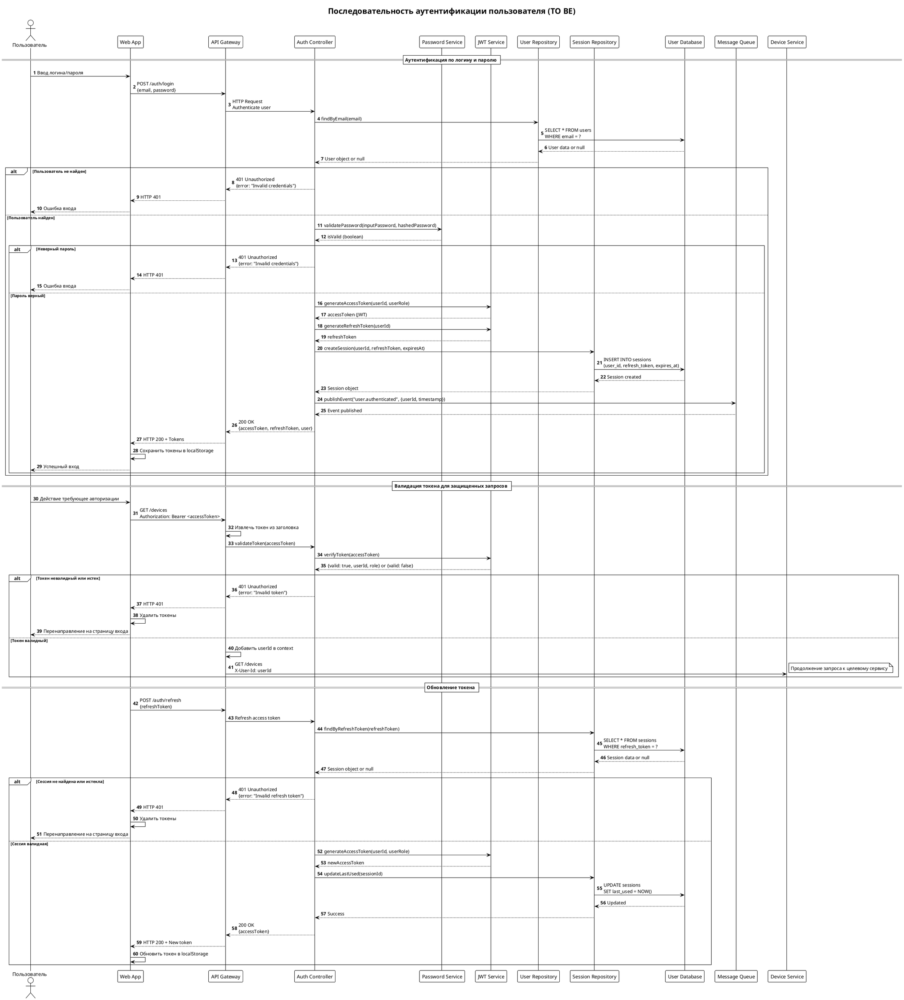
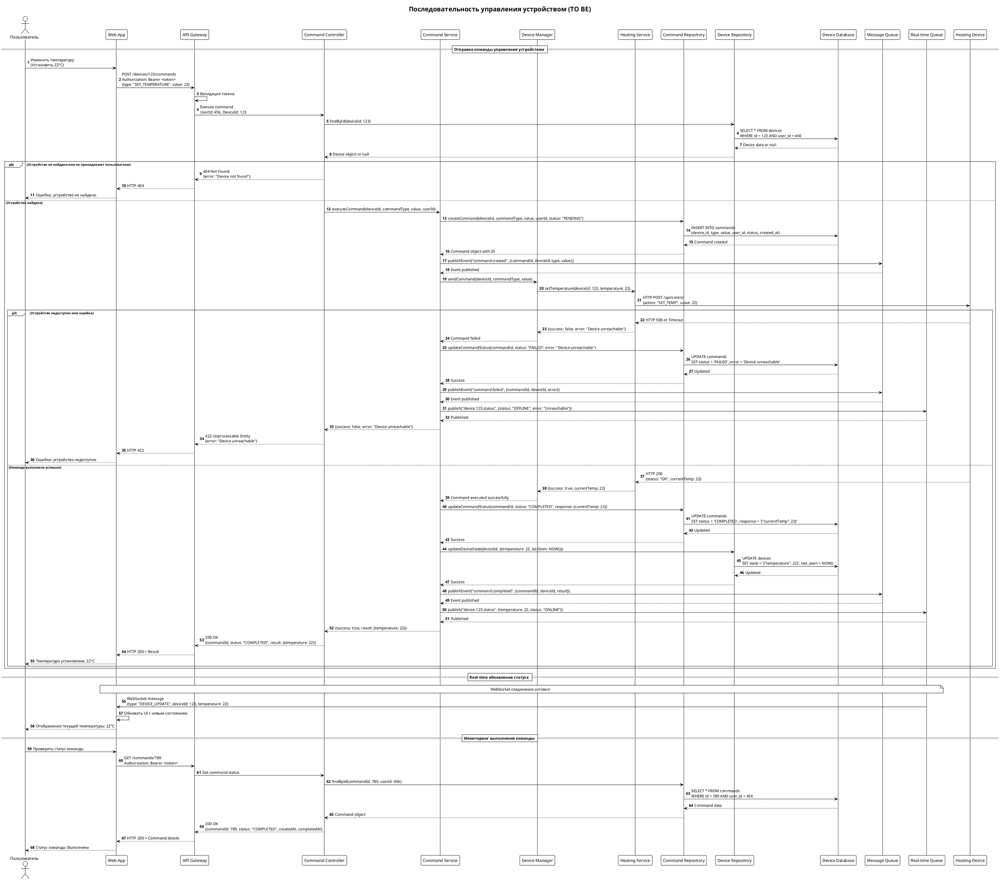
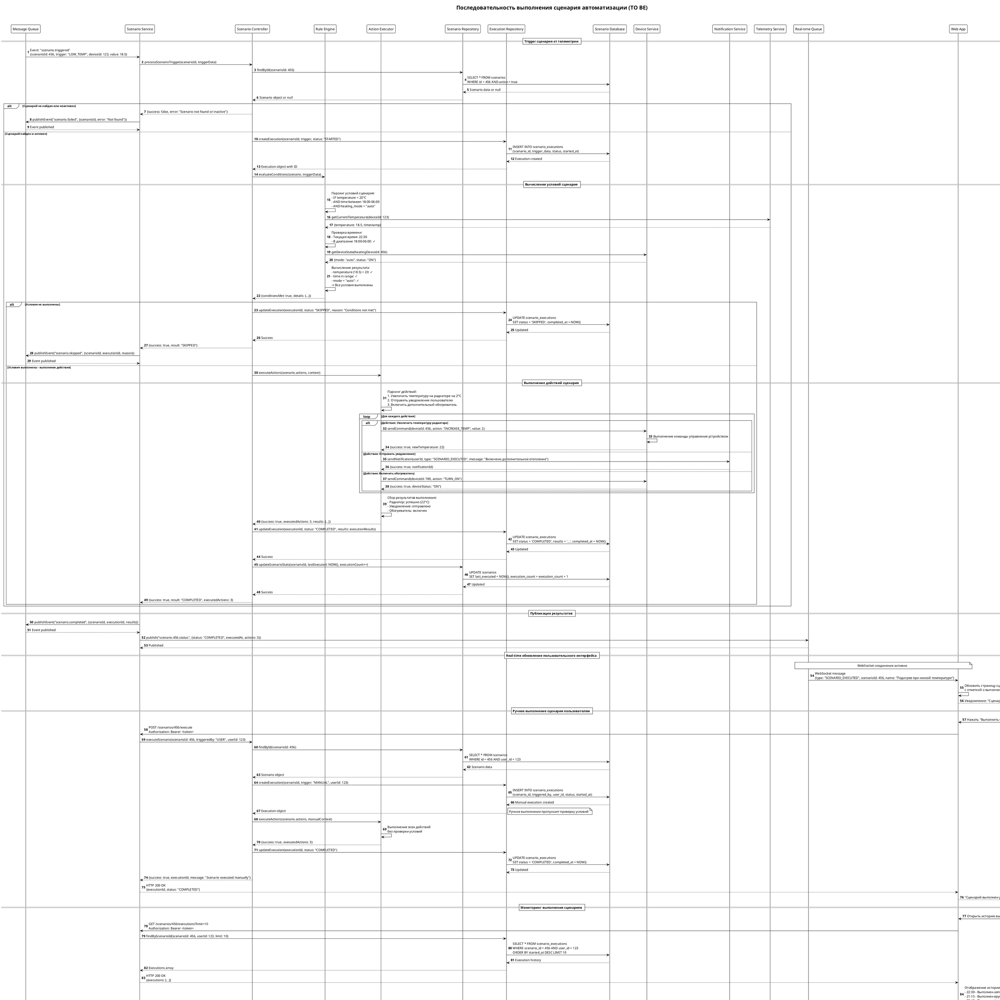
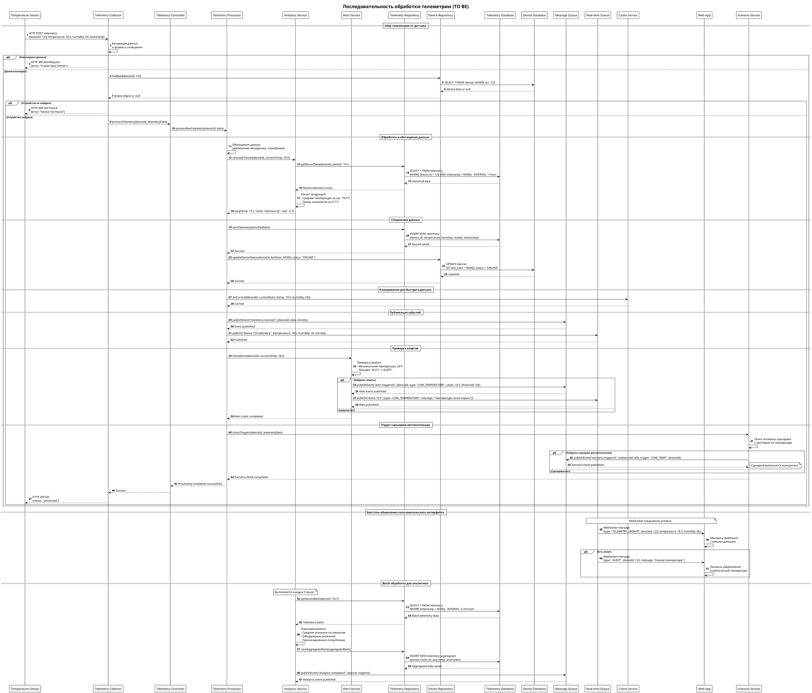

# Задание 2

# Containers diagram

```puml
@startuml
!include https://raw.githubusercontent.com/plantuml-stdlib/C4-PlantUML/master/C4_Container.puml

title Smart Home - Containers Diagram (TO BE)

Person(user, "Пользователь", "Владелец умного дома")
System_Ext(partnerApis, "Partner APIs", "API партнеров для интеграции устройств")

System_Boundary(platform, "Smart Home Platform") {
    Container(webApp, "Web Application", "SPA", "Веб-интерфейс для управления умным домом")

    Container(apiGateway, "API Gateway", "Nginx", "Единая точка входа, маршрутизация, аутентификация, rate limiting")

    Container(authService, "Auth Service", "Go/Node.js", "Управление пользователями, подписки SaaS, аутентификация")
    Container(deviceService, "Device Service", "Go/Node.js", "Управление всеми типами устройств, команды управления")
    Container(scenarioService, "Scenario Service", "Go/Node.js", "Пользовательские сценарии автоматизации, правила")
    Container(telemetryService, "Telemetry Service", "Go/Node.js", "Сбор, обработка и хранение телеметрии устройств")
    Container(integrationService, "Integration Service", "Go/Node.js", "Интеграция с партнерскими API и устройствами")
    Container(notificationService, "Notification Service", "Go/Node.js", "Push-уведомления, email, SMS алерты")

    ContainerDb(userDb, "User Database", "PostgreSQL", "Пользователи, подписки, биллинг")
    ContainerDb(deviceDb, "Device Database", "PostgreSQL", "Метаданные устройств, состояния, конфигурации")
    ContainerDb(telemetryDb, "Telemetry Database", "PostgreSQL", "База данных для хранения телеметрии")
    ContainerDb(scenarioDb, "Scenario Database", "PostgreSQL", "Сценарии автоматизации, правила")

    Container(messageQueue, "Message Queue", "Apache Kafka", "Event streaming между микросервисами")
    Container(realTimeQueue, "Real-time Queue", "Redis Pub/Sub", "Real-time уведомления и WebSocket коммуникация")
}

' Пользовательские интерфейсы
Rel(user, webApp, "Использует", "HTTPS")
Rel(webApp, apiGateway, "API calls", "HTTPS/WSS")

' API Gateway маршрутизация
Rel(apiGateway, authService, "Маршрутизация запросов", "HTTP/gRPC")
Rel(apiGateway, deviceService, "Маршрутизация запросов", "HTTP/gRPC")
Rel(apiGateway, scenarioService, "Маршрутизация запросов", "HTTP/gRPC")
Rel(apiGateway, telemetryService, "Маршрутизация запросов", "HTTP/gRPC")
Rel(apiGateway, notificationService, "Маршрутизация запросов", "HTTP/gRPC")

' Микросервисы и базы данных
Rel(authService, userDb, "Запись/чтение", "SQL")
Rel(deviceService, deviceDb, "Запись/чтение", "SQL")
Rel(telemetryService, telemetryDb, "Запись", "SQL")
Rel(scenarioService, scenarioDb, "Запись/чтение", "SQL")

' Event streaming
Rel(deviceService, messageQueue, "Device events", "Kafka Protocol")
Rel(scenarioService, messageQueue, "Scenario events", "Kafka Protocol")
Rel(telemetryService, messageQueue, "Telemetry events", "Kafka Protocol")
Rel(notificationService, messageQueue, "Consumes events", "Kafka Protocol")

' Real-time коммуникация
Rel(deviceService, realTimeQueue, "Real-time updates", "Redis Pub/Sub")
Rel(notificationService, realTimeQueue, "Push notifications", "Redis Pub/Sub")
Rel(apiGateway, realTimeQueue, "WebSocket updates", "Redis Pub/Sub")

' Внешние интеграции
Rel(integrationService, partnerApis, "Integration", "HTTP/MQTT")
Rel(deviceService, integrationService, "Partner devices", "gRPC")

@enduml
```

# Микросервисы

## 1. Auth Service

**Домен:** Управление пользователями и подписками

**Ответственность:** Аутентификация, авторизация, SaaS подписки

```puml
@startuml
!include https://raw.githubusercontent.com/plantuml-stdlib/C4-PlantUML/master/C4_Component.puml

title Auth Service - Components Diagram (TO BE)

Person(user, "Пользователь", "Владелец умного дома")
Container(webApp, "Web Application", "SPA", "Веб-интерфейс")
Container(apiGateway, "API Gateway", "Nginx", "Единая точка входа")

Container_Boundary(authService, "Auth Service") {
    Component(authController, "Authentication Controller", "Go/Node.js", "REST API для аутентификации, login/logout")
    Component(userController, "User Management Controller", "Go/Node.js", "REST API для управления профилем пользователя")
    Component(subscriptionController, "Subscription Controller", "Go/Node.js", "REST API для управления подписками SaaS")

    Component(jwtService, "JWT Token Service", "Go/Node.js", "Создание, валидация и управление JWT токенами")
    Component(passwordService, "Password Service", "Go/Node.js", "Хеширование и проверка паролей")
    Component(oauthProvider, "OAuth Provider", "Go/Node.js", "Интеграция с Google, Facebook, GitHub OAuth")
    Component(emailService, "Email Service", "Go/Node.js", "Отправка email для восстановления пароля, верификации")
    Component(billingService, "Billing Service", "Go/Node.js", "Обработка платежей и биллинг подписок")

    Component(userRepository, "User Repository", "Go/Node.js", "Доступ к данным пользователей в БД")
    Component(subscriptionRepository, "Subscription Repository", "Go/Node.js", "Доступ к данным подписок в БД")
    Component(sessionRepository, "Session Repository", "Go/Node.js", "Управление пользовательскими сессиями")
}

ContainerDb(userDb, "User Database", "PostgreSQL", "Пользователи, подписки, сессии")
Container(messageQueue, "Message Queue", "Apache Kafka", "Event streaming")
System_Ext(emailProvider, "Email Provider", "SendGrid/AWS SES")
System_Ext(paymentProvider, "Payment Provider", "Stripe/PayPal")
System_Ext(oauthProviders, "OAuth Providers", "Google, Facebook, GitHub")

' Внешние связи
Rel(user, webApp, "Использует", "HTTPS")
Rel(webApp, apiGateway, "API calls", "HTTPS")
Rel(apiGateway, authController, "Authentication requests", "HTTP/gRPC")
Rel(apiGateway, userController, "User management", "HTTP/gRPC")
Rel(apiGateway, subscriptionController, "Subscription management", "HTTP/gRPC")

' Внутренние связи контроллеров
Rel(authController, jwtService, "Создает/валидирует токены", "")
Rel(authController, passwordService, "Проверяет пароли", "")
Rel(authController, oauthProvider, "OAuth аутентификация", "")
Rel(authController, userRepository, "Получает данные пользователей", "")
Rel(authController, sessionRepository, "Управляет сессиями", "")

Rel(userController, userRepository, "CRUD операции", "")
Rel(userController, emailService, "Отправляет уведомления", "")
Rel(userController, passwordService, "Хеширует новые пароли", "")

Rel(subscriptionController, subscriptionRepository, "CRUD операции", "")
Rel(subscriptionController, billingService, "Обрабатывает платежи", "")
Rel(subscriptionController, userRepository, "Связывает с пользователями", "")

' Связи сервисов с внешними системами
Rel(emailService, emailProvider, "Отправляет email", "SMTP/API")
Rel(billingService, paymentProvider, "Обрабатывает платежи", "HTTPS API")
Rel(oauthProvider, oauthProviders, "OAuth flow", "HTTPS")

' Связи с базой данных
Rel(userRepository, userDb, "Users table", "SQL")
Rel(subscriptionRepository, userDb, "Subscriptions table", "SQL")
Rel(sessionRepository, userDb, "Sessions table", "SQL")

' Event streaming
Rel(authController, messageQueue, "События аутентификации", "Kafka")
Rel(userController, messageQueue, "События пользователя", "Kafka")
Rel(subscriptionController, messageQueue, "События подписки", "Kafka")

@enduml
```

### Аутентификация пользователя



## 2. Device Service

**Домен:** Управление устройствами

**Ответственность:** CRUD устройств, команды управления, состояния устройств

```puml
@startuml
!include https://raw.githubusercontent.com/plantuml-stdlib/C4-PlantUML/master/C4_Component.puml

title Device Service - Components Diagram (TO BE)

Person(user, "Пользователь", "Владелец умного дома")
Container(webApp, "Web Application", "SPA", "Веб-интерфейс")
Container(apiGateway, "API Gateway", "Nginx", "Единая точка входа")

Container_Boundary(deviceService, "Device Service") {
    Component(deviceController, "Device Controller", "Go/Node.js", "REST API для управления устройствами, CRUD операции")
    Component(sensorController, "Sensor Controller", "Go/Node.js", "REST API для управления датчиками температуры")
    Component(heatingController, "Heating Controller", "Go/Node.js", "REST API для управления системами отопления")
    Component(commandController, "Command Controller", "Go/Node.js", "REST API для отправки команд устройствам")

    Component(deviceManager, "Device Manager", "Go/Node.js", "Основная логика управления устройствами")
    Component(sensorService, "Sensor Service", "Go/Node.js", "Обработка данных датчиков температуры")
    Component(heatingService, "Heating Service", "Go/Node.js", "Управление системами отопления, термостатами")
    Component(commandService, "Command Service", "Go/Node.js", "Очередь и выполнение команд устройствам")
    Component(telemetryCollector, "Telemetry Collector", "Go/Node.js", "Сбор телеметрии от устройств")

    Component(deviceRepository, "Device Repository", "Go/Node.js", "Доступ к метаданным устройств в БД")
    Component(sensorRepository, "Sensor Repository", "Go/Node.js", "Доступ к данным датчиков в БД")
    Component(heatingRepository, "Heating Repository", "Go/Node.js", "Доступ к данным систем отопления")
    Component(commandRepository, "Command Repository", "Go/Node.js", "История команд и статусы выполнения")
}

ContainerDb(deviceDb, "Device Database", "PostgreSQL", "Метаданные устройств, состояния, конфигурации")
Container(messageQueue, "Message Queue", "Apache Kafka", "Event streaming")
Container(realTimeQueue, "Real-time Queue", "Redis Pub/Sub", "Real-time уведомления")
System_Ext(sensors, "Датчики", "Физические датчики температуры")
System_Ext(heatingDevices, "Системы отопления", "Котлы, радиаторы, термостаты")

' Внешние связи
Rel(user, webApp, "Использует", "HTTPS")
Rel(webApp, apiGateway, "API calls", "HTTPS")
Rel(apiGateway, deviceController, "Управление устройствами", "HTTP/gRPC")
Rel(apiGateway, sensorController, "Управление датчиками", "HTTP/gRPC")
Rel(apiGateway, heatingController, "Управление отоплением", "HTTP/gRPC")
Rel(apiGateway, commandController, "Управление командами", "HTTP/gRPC")

' Внутренние связи контроллеров
Rel(deviceController, deviceManager, "Основные операции", "")
Rel(deviceController, deviceRepository, "CRUD операции", "")

Rel(sensorController, sensorService, "Обработка датчиков", "")
Rel(sensorController, sensorRepository, "CRUD операции", "")
Rel(sensorController, telemetryCollector, "Сбор данных", "")

Rel(heatingController, heatingService, "Управление отоплением", "")
Rel(heatingController, heatingRepository, "CRUD операции", "")

Rel(commandController, commandService, "Выполнение команд", "")
Rel(commandController, commandRepository, "История команд", "")

' Связи сервисов
Rel(deviceManager, sensorService, "Управление датчиками", "")
Rel(deviceManager, heatingService, "Управление отоплением", "")
Rel(deviceManager, telemetryCollector, "Сбор телеметрии", "")

Rel(commandService, deviceManager, "Выполнение команд", "")

' Связи с базой данных
Rel(deviceRepository, deviceDb, "Devices table", "SQL")
Rel(sensorRepository, deviceDb, "Sensors table", "SQL")
Rel(heatingRepository, deviceDb, "HeatingSystems table", "SQL")
Rel(commandRepository, deviceDb, "Commands table", "SQL")

' Event streaming
Rel(deviceManager, messageQueue, "События устройств", "Kafka")
Rel(sensorService, messageQueue, "События датчиков", "Kafka")
Rel(heatingService, messageQueue, "События отопления", "Kafka")
Rel(commandService, messageQueue, "События команд", "Kafka")
Rel(telemetryCollector, messageQueue, "События телеметрии", "Kafka")

' Real-time коммуникация
Rel(deviceManager, realTimeQueue, "Состояния устройств", "Redis Pub/Sub")
Rel(sensorService, realTimeQueue, "Данные датчиков", "Redis Pub/Sub")
Rel(heatingService, realTimeQueue, "Состояния отопления", "Redis Pub/Sub")

' Связи с физическими устройствами
Rel(sensorService, sensors, "Чтение данных", "API устройств")
Rel(heatingService, heatingDevices, "Управление", "API устройств")
Rel(telemetryCollector, sensors, "Сбор телеметрии", "API устройств")
Rel(telemetryCollector, heatingDevices, "Сбор телеметрии", "API устройств")

@enduml
```

### Управление устройством



## 3. Scenario Service

**Домен:** Автоматизация и пользовательские сценарии

**Ответственность**: Правила автоматизации, триггеры, планировщик

```puml

@startuml
!include https://raw.githubusercontent.com/plantuml-stdlib/C4-PlantUML/master/C4_Component.puml

title Scenario Service - Components Diagram (TO BE)

Person(user, "Пользователь", "Владелец умного дома")
Container(webApp, "Web Application", "SPA", "Веб-интерфейс")
Container(apiGateway, "API Gateway", "Nginx", "Единая точка входа")

Container_Boundary(scenarioService, "Scenario Service") {
    Component(scenarioController, "Scenario Controller", "Go/Node.js", "REST API для управления сценариями, CRUD операции")
    Component(ruleController, "Rule Controller", "Go/Node.js", "REST API для управления правилами автоматизации")
    Component(automationController, "Automation Controller", "Go/Node.js", "REST API для управления автоматическими действиями")
    Component(schedulerController, "Scheduler Controller", "Go/Node.js", "REST API для управления расписаниями выполнения")

    Component(scenarioManager, "Scenario Manager", "Go/Node.js", "Основная логика управления пользовательскими сценариями")
    Component(ruleEngine, "Rule Engine", "Go/Node.js", "Обработка правил, условий и логических операций")
    Component(automationService, "Automation Service", "Go/Node.js", "Выполнение автоматических действий по сценариям")
    Component(eventProcessor, "Event Processor", "Go/Node.js", "Обработка событий от устройств и триггеров")
    Component(schedulerService, "Scheduler Service", "Go/Node.js", "Управление расписаниями и временными триггерами")
    Component(validationService, "Validation Service", "Go/Node.js", "Валидация сценариев и правил")

    Component(scenarioRepository, "Scenario Repository", "Go/Node.js", "Доступ к данным сценариев в БД")
    Component(ruleRepository, "Rule Repository", "Go/Node.js", "Доступ к данным правил и условий")
    Component(automationRepository, "Automation Repository", "Go/Node.js", "История выполнения автоматических действий")
    Component(scheduleRepository, "Schedule Repository", "Go/Node.js", "Доступ к данным расписаний и триггеров")
}

ContainerDb(scenarioDb, "Scenario Database", "PostgreSQL", "Сценарии автоматизации, правила")
Container(messageQueue, "Message Queue", "Apache Kafka", "Event streaming")
Container(realTimeQueue, "Real-time Queue", "Redis Pub/Sub", "Real-time уведомления")
Container_Ext(deviceService, "Device Service", "Go/Node.js", "Управление устройствами")
Container_Ext(notificationService, "Notification Service", "Go/Node.js", "Уведомления")

' Внешние связи
Rel(user, webApp, "Использует", "HTTPS")
Rel(webApp, apiGateway, "API calls", "HTTPS")
Rel(apiGateway, scenarioController, "Управление сценариями", "HTTP/gRPC")
Rel(apiGateway, ruleController, "Управление правилами", "HTTP/gRPC")
Rel(apiGateway, automationController, "Управление автоматизацией", "HTTP/gRPC")
Rel(apiGateway, schedulerController, "Управление расписаниями", "HTTP/gRPC")

' Внутренние связи контроллеров
Rel(scenarioController, scenarioManager, "Основные операции", "")
Rel(scenarioController, validationService, "Валидация сценариев", "")
Rel(scenarioController, scenarioRepository, "CRUD операции", "")

Rel(ruleController, ruleEngine, "Обработка правил", "")
Rel(ruleController, validationService, "Валидация правил", "")
Rel(ruleController, ruleRepository, "CRUD операции", "")

Rel(automationController, automationService, "Управление автоматизацией", "")
Rel(automationController, automationRepository, "История выполнения", "")

Rel(schedulerController, schedulerService, "Управление расписаниями", "")
Rel(schedulerController, scheduleRepository, "CRUD операции", "")

' Связи сервисов
Rel(scenarioManager, ruleEngine, "Применение правил", "")
Rel(scenarioManager, automationService, "Запуск автоматизации", "")
Rel(scenarioManager, eventProcessor, "Обработка событий", "")

Rel(ruleEngine, eventProcessor, "Оценка условий", "")
Rel(automationService, eventProcessor, "Триггеры действий", "")
Rel(schedulerService, eventProcessor, "Временные события", "")

Rel(eventProcessor, scenarioManager, "Активация сценариев", "")

' Связи с базой данных
Rel(scenarioRepository, scenarioDb, "Scenarios table", "SQL")
Rel(ruleRepository, scenarioDb, "Rules table", "SQL")
Rel(automationRepository, scenarioDb, "Automations table", "SQL")
Rel(scheduleRepository, scenarioDb, "Schedules table", "SQL")

' Event streaming
Rel(scenarioManager, messageQueue, "События сценариев", "Kafka")
Rel(ruleEngine, messageQueue, "События правил", "Kafka")
Rel(automationService, messageQueue, "События автоматизации", "Kafka")
Rel(eventProcessor, messageQueue, "События устройств", "Kafka")
Rel(schedulerService, messageQueue, "События расписаний", "Kafka")

' Real-time коммуникация
Rel(scenarioManager, realTimeQueue, "Статусы сценариев", "Redis Pub/Sub")
Rel(automationService, realTimeQueue, "Статусы автоматизации", "Redis Pub/Sub")

' Связи с другими сервисами
Rel(automationService, deviceService, "Команды устройствам", "gRPC")
Rel(automationService, notificationService, "Отправка уведомлений", "gRPC")

@enduml

```

### Выполнение сценария



## 4. Telemetry Service

**Домен** Сбор и обработка телеметрии

**Ответственность:** Метрики устройств, аналитика

```puml

@startuml
!include https://raw.githubusercontent.com/plantuml-stdlib/C4-PlantUML/master/C4_Component.puml

title Telemetry Service - Components Diagram (TO BE)

Person(user, "Пользователь", "Владелец умного дома")
Container(webApp, "Web Application", "SPA", "Веб-интерфейс")
Container(apiGateway, "API Gateway", "Nginx", "Единая точка входа")

Container_Boundary(telemetryService, "Telemetry Service") {
    Component(telemetryController, "Telemetry Controller", "Go/Node.js", "REST API для получения телеметрических данных")
    Component(analyticsController, "Analytics Controller", "Go/Node.js", "REST API для аналитики и отчетов")
    Component(alertsController, "Alerts Controller", "Go/Node.js", "REST API для управления алертами по телеметрии")

    Component(dataCollector, "Data Collector", "Go/Node.js", "Сбор телеметрических данных от устройств")
    Component(dataProcessor, "Data Processor", "Go/Node.js", "Обработка и валидация входящих данных")
    Component(aggregationService, "Aggregation Service", "Go/Node.js", "Агрегация данных по временным интервалам")
    Component(analyticsEngine, "Analytics Engine", "Go/Node.js", "Анализ трендов, вычисление метрик")
    Component(alertsEngine, "Alerts Engine", "Go/Node.js", "Обработка алертов и пороговых значений")

    Component(telemetryRepository, "Telemetry Repository", "Go/Node.js", "Доступ к телеметрическим данным в БД")
    Component(metricsRepository, "Metrics Repository", "Go/Node.js", "Доступ к агрегированным метрикам")
    Component(alertsRepository, "Alerts Repository", "Go/Node.js", "Доступ к настройкам и истории алертов")
}

ContainerDb(telemetryDb, "Telemetry Database", "PostgreSQL", "Телеметрические данные, метрики, алерты")
Container(messageQueue, "Message Queue", "Apache Kafka", "Event streaming")
Container(realTimeQueue, "Real-time Queue", "Redis Pub/Sub", "Real-time уведомления")
Container(timeSeriesDb, "Time Series Database", "InfluxDB", "Высокопроизводительное хранение временных рядов")
Container_Ext(deviceService, "Device Service", "Go/Node.js", "Источник телеметрии устройств")
Container_Ext(notificationService, "Notification Service", "Go/Node.js", "Уведомления об алертах")

' Внешние связи
Rel(user, webApp, "Использует", "HTTPS")
Rel(webApp, apiGateway, "API calls", "HTTPS")
Rel(apiGateway, telemetryController, "Получение телеметрии", "HTTP/gRPC")
Rel(apiGateway, analyticsController, "Аналитика и отчеты", "HTTP/gRPC")
Rel(apiGateway, alertsController, "Управление алертами", "HTTP/gRPC")

' Внутренние связи контроллеров
Rel(telemetryController, dataCollector, "Получение данных", "")
Rel(telemetryController, telemetryRepository, "Чтение телеметрии", "")

Rel(analyticsController, analyticsEngine, "Аналитика", "")
Rel(analyticsController, metricsRepository, "Получение метрик", "")

Rel(alertsController, alertsEngine, "Управление алертами", "")
Rel(alertsController, alertsRepository, "CRUD операции", "")

' Связи сервисов
Rel(dataCollector, dataProcessor, "Обработка данных", "")
Rel(dataProcessor, aggregationService, "Агрегация", "")
Rel(dataProcessor, alertsEngine, "Проверка пороговых значений", "")

Rel(aggregationService, analyticsEngine, "Анализ агрегированных данных", "")
Rel(analyticsEngine, alertsEngine, "Аналитические алерты", "")

' Связи с базами данных
Rel(telemetryRepository, telemetryDb, "Telemetry table", "SQL")
Rel(telemetryRepository, timeSeriesDb, "Raw telemetry data", "InfluxQL")
Rel(metricsRepository, telemetryDb, "Metrics table", "SQL")
Rel(alertsRepository, telemetryDb, "Alerts table", "SQL")

' Event streaming
Rel(dataCollector, messageQueue, "События сбора данных", "Kafka")
Rel(dataProcessor, messageQueue, "События обработки", "Kafka")
Rel(aggregationService, messageQueue, "События агрегации", "Kafka")
Rel(alertsEngine, messageQueue, "События алертов", "Kafka")
Rel(messageQueue, dataCollector, "События от устройств", "Kafka")

' Real-time коммуникация
Rel(dataProcessor, realTimeQueue, "Real-time данные", "Redis Pub/Sub")
Rel(alertsEngine, realTimeQueue, "Real-time алерты", "Redis Pub/Sub")
Rel(analyticsEngine, realTimeQueue, "Real-time аналитика", "Redis Pub/Sub")

' Связи с другими сервисами
Rel(deviceService, dataCollector, "Телеметрия устройств", "gRPC/HTTP")
Rel(alertsEngine, notificationService, "Отправка алертов", "gRPC")

@enduml

```

### Обработчка телеметрии



## 5. Notification Service

**Домен:** Уведомления и коммуникации

**Ответственности:** Push-уведомления, email, SMS, WebSocket

```puml

@startuml
!include https://raw.githubusercontent.com/plantuml-stdlib/C4-PlantUML/master/C4_Component.puml

title Notification Service - Components Diagram (TO BE)

Person(user, "Пользователь", "Владелец умного дома")
Container(webApp, "Web Application", "SPA", "Веб-интерфейс")
Container(apiGateway, "API Gateway", "Nginx", "Единая точка входа")

Container_Boundary(notificationService, "Notification Service") {
    Component(notificationController, "Notification Controller", "Go/Node.js", "REST API для управления уведомлениями, получение истории")
    Component(emailController, "Email Controller", "Go/Node.js", "REST API для email уведомлений и рассылок")
    Component(smsController, "SMS Controller", "Go/Node.js", "REST API для SMS алертов и уведомлений")

    Component(notificationManager, "Notification Manager", "Go/Node.js", "Основная логика управления уведомлениями")
    Component(emailService, "Email Service", "Go/Node.js", "Отправка email через SMTP провайдеров")
    Component(smsService, "SMS Service", "Go/Node.js", "Отправка SMS через SMS провайдеров")
    Component(templateService, "Template Service", "Go/Node.js", "Управление шаблонами уведомлений")
    Component(subscriptionService, "Subscription Service", "Go/Node.js", "Управление подписками пользователей на уведомления")
    Component(eventProcessor, "Event Processor", "Go/Node.js", "Обработка событий из Kafka для триггеров уведомлений")

    Component(notificationRepository, "Notification Repository", "Go/Node.js", "Доступ к истории отправленных уведомлений")
    Component(templateRepository, "Template Repository", "Go/Node.js", "Доступ к шаблонам уведомлений в БД")
    Component(subscriptionRepository, "Subscription Repository", "Go/Node.js", "Доступ к подпискам пользователей")
    Component(deviceTokenRepository, "Device Token Repository", "Go/Node.js", "Доступ к токенам устройств для push")
}

ContainerDb(notificationDb, "Notification Database", "PostgreSQL", "История уведомлений, шаблоны, подписки")
Container(messageQueue, "Message Queue", "Apache Kafka", "Event streaming")
Container(realTimeQueue, "Real-time Queue", "Redis Pub/Sub", "Real-time уведомления")
System_Ext(emailProvider, "Email Provider", "SendGrid / AWS SES")
System_Ext(smsProvider, "SMS Provider", "Twilio / AWS SNS")
Container_Ext(authService, "Auth Service", "Go/Node.js", "Пользовательские данные")
Container_Ext(telemetryService, "Telemetry Service", "Go/Node.js", "События алертов")

' Внешние связи
Rel(user, webApp, "Использует", "HTTPS")
Rel(webApp, apiGateway, "API calls", "HTTPS")
Rel(apiGateway, notificationController, "Управление уведомлениями", "HTTP/gRPC")
Rel(apiGateway, emailController, "Email уведомления", "HTTP/gRPC")
Rel(apiGateway, smsController, "SMS уведомления", "HTTP/gRPC")

' Внутренние связи контроллеров
Rel(notificationController, notificationManager, "Основные операции", "")
Rel(notificationController, notificationRepository, "История уведомлений", "")
Rel(notificationController, subscriptionService, "Управление подписками", "")

Rel(emailController, emailService, "Отправка email", "")
Rel(emailController, templateService, "Шаблоны email", "")

Rel(smsController, smsService, "Отправка SMS", "")
Rel(smsController, templateService, "Шаблоны SMS", "")

' Связи сервисов
Rel(notificationManager, emailService, "Email уведомления", "")
Rel(notificationManager, smsService, "SMS уведомления", "")
Rel(notificationManager, templateService, "Получение шаблонов", "")
Rel(notificationManager, subscriptionService, "Проверка подписок", "")

Rel(eventProcessor, notificationManager, "Триггер уведомлений", "")

Rel(templateService, templateRepository, "CRUD шаблонов", "")
Rel(subscriptionService, subscriptionRepository, "CRUD подписок", "")

' Связи с базой данных
Rel(notificationRepository, notificationDb, "Notifications table", "SQL")
Rel(templateRepository, notificationDb, "Templates table", "SQL")
Rel(subscriptionRepository, notificationDb, "Subscriptions table", "SQL")

' Event streaming
Rel(messageQueue, eventProcessor, "События от других сервисов", "Kafka")
Rel(notificationManager, messageQueue, "События уведомлений", "Kafka")
Rel(emailService, messageQueue, "События email", "Kafka")
Rel(smsService, messageQueue, "События SMS", "Kafka")

' Real-time коммуникация
Rel(notificationManager, realTimeQueue, "Real-time уведомления", "Redis Pub/Sub")
Rel(emailService, realTimeQueue, "Email статусы", "Redis Pub/Sub")
Rel(smsService, realTimeQueue, "SMS статусы", "Redis Pub/Sub")

' Связи с внешними провайдерами
Rel(emailService, emailProvider, "Отправка email", "SMTP/API")
Rel(smsService, smsProvider, "Отправка SMS", "HTTPS API")

' Связи с другими сервисами
Rel(authService, subscriptionService, "Данные пользователей", "gRPC")
Rel(telemetryService, eventProcessor, "События алертов", "Kafka")

@enduml

```
