# Задание 3

# ER диаграмма

```puml

@startuml
!theme plain

title Smart Home - Entity Relationship Diagram (TO BE)

entity "users" as users {
  * id : UUID <<PK>>
  --
  * email : VARCHAR(255) <<unique>>
  * password_hash : VARCHAR(255)
  * first_name : VARCHAR(100)
  * last_name : VARCHAR(100)
  * phone : VARCHAR(20)
  * timezone : VARCHAR(50)
  * created_at : TIMESTAMP
  * updated_at : TIMESTAMP
}

entity "subscriptions" as subscriptions {
  * id : UUID <<PK>>
  * user_id : UUID <<FK>>
  --
  * plan_type : VARCHAR(50)
  * status : VARCHAR(20)
  * price : DECIMAL(10,2)
  * billing_period : VARCHAR(20)
  * created_at : TIMESTAMP
  * expires_at : TIMESTAMP
}

entity "user_sessions" as sessions {
  * id : UUID <<PK>>
  * user_id : UUID <<FK>>
  --
  * token : VARCHAR(512)
  * refresh_token : VARCHAR(512)
  * expires_at : TIMESTAMP
  * created_at : TIMESTAMP
}

entity "devices" as devices {
  * id : UUID <<PK>>
  * user_id : UUID <<FK>>
  --
  * name : VARCHAR(100)
  * type : VARCHAR(50)
  * model : VARCHAR(100)
  * manufacturer : VARCHAR(100)
  * serial_number : VARCHAR(100)
  * mac_address : VARCHAR(18)
  * status : VARCHAR(20)
  * configuration : JSONB
  * location : VARCHAR(100)
  * created_at : TIMESTAMP
  * updated_at : TIMESTAMP
}

entity "sensors" as sensors {
  * id : UUID <<PK>>
  * device_id : UUID <<FK>>
  --
  * type : VARCHAR(50)
  * location : VARCHAR(100)
  * unit : VARCHAR(20)
  * min_value : DECIMAL(10,4)
  * max_value : DECIMAL(10,4)
  * calibration_data : JSONB
  * is_active : BOOLEAN
  * created_at : TIMESTAMP
}

entity "heating_systems" as heating_systems {
  * id : UUID <<PK>>
  * device_id : UUID <<FK>>
  --
  * type : VARCHAR(50)
  * capacity : DECIMAL(10,2)
  * power_consumption : DECIMAL(10,2)
  * configuration : JSONB
  * temperature_range_min : DECIMAL(5,2)
  * temperature_range_max : DECIMAL(5,2)
  * is_active : BOOLEAN
  * created_at : TIMESTAMP
}

entity "device_commands" as commands {
  * id : UUID <<PK>>
  * device_id : UUID <<FK>>
  * user_id : UUID <<FK>>
  --
  * command_type : VARCHAR(50)
  * command_data : JSONB
  * status : VARCHAR(20)
  * result_data : JSONB
  * error_message : TEXT
  * created_at : TIMESTAMP
  * executed_at : TIMESTAMP
}

entity "scenarios" as scenarios {
  * id : UUID <<PK>>
  * user_id : UUID <<FK>>
  --
  * name : VARCHAR(100)
  * description : TEXT
  * status : VARCHAR(20)
  * is_active : BOOLEAN
  * priority : INTEGER
  * created_at : TIMESTAMP
  * updated_at : TIMESTAMP
}

entity "scenario_rules" as rules {
  * id : UUID <<PK>>
  * scenario_id : UUID <<FK>>
  --
  * condition_type : VARCHAR(50)
  * condition_data : JSONB
  * action_type : VARCHAR(50)
  * action_data : JSONB
  * execution_order : INTEGER
  * is_active : BOOLEAN
}

entity "scenario_automations" as automations {
  * id : UUID <<PK>>
  * scenario_id : UUID <<FK>>
  * device_id : UUID <<FK>>
  --
  * execution_status : VARCHAR(20)
  * executed_at : TIMESTAMP
  * execution_duration : INTEGER
  * result_data : JSONB
  * error_message : TEXT
}

entity "scenario_schedules" as schedules {
  * id : UUID <<PK>>
  * scenario_id : UUID <<FK>>
  --
  * schedule_type : VARCHAR(50)
  * cron_expression : VARCHAR(100)
  * time_zone : VARCHAR(50)
  * is_active : BOOLEAN
  * next_execution : TIMESTAMP
  * created_at : TIMESTAMP
}

entity "telemetry_data" as telemetry {
  * id : UUID <<PK>>
  * device_id : UUID <<FK>>
  * sensor_id : UUID <<FK>>
  --
  * metric_type : VARCHAR(50)
  * value : DECIMAL(15,6)
  * unit : VARCHAR(20)
  * quality : VARCHAR(20)
  * timestamp : TIMESTAMP
  * created_at : TIMESTAMP
}

entity "telemetry_metrics" as metrics {
  * id : UUID <<PK>>
  * device_id : UUID <<FK>>
  --
  * metric_type : VARCHAR(50)
  * aggregated_value : DECIMAL(15,6)
  * min_value : DECIMAL(15,6)
  * max_value : DECIMAL(15,6)
  * avg_value : DECIMAL(15,6)
  * time_period : VARCHAR(20)
  * period_start : TIMESTAMP
  * period_end : TIMESTAMP
  * created_at : TIMESTAMP
}

entity "telemetry_alerts" as alerts {
  * id : UUID <<PK>>
  * user_id : UUID <<FK>>
  * device_id : UUID <<FK>>
  --
  * alert_type : VARCHAR(50)
  * threshold_value : DECIMAL(15,6)
  * comparison_operator : VARCHAR(10)
  * message_template : TEXT
  * is_active : BOOLEAN
  * severity : VARCHAR(20)
  * created_at : TIMESTAMP
}

entity "integrations" as integrations {
  * id : UUID <<PK>>
  * user_id : UUID <<FK>>
  --
  * provider_name : VARCHAR(100)
  * provider_type : VARCHAR(50)
  * configuration : JSONB
  * credentials : JSONB
  * status : VARCHAR(20)
  * last_sync_at : TIMESTAMP
  * created_at : TIMESTAMP
}

entity "integration_connectors" as connectors {
  * id : UUID <<PK>>
  * integration_id : UUID <<FK>>
  --
  * connector_type : VARCHAR(50)
  * endpoint_url : VARCHAR(500)
  * protocol : VARCHAR(20)
  * credentials : JSONB
  * polling_interval : INTEGER
  * is_active : BOOLEAN
  * created_at : TIMESTAMP
}

entity "sync_history" as sync_history {
  * id : UUID <<PK>>
  * integration_id : UUID <<FK>>
  --
  * sync_type : VARCHAR(50)
  * sync_status : VARCHAR(20)
  * data_count : INTEGER
  * error_count : INTEGER
  * error_message : TEXT
  * started_at : TIMESTAMP
  * completed_at : TIMESTAMP
}

entity "notifications" as notifications {
  * id : UUID <<PK>>
  * user_id : UUID <<FK>>
  * template_id : UUID <<FK>>
  --
  * notification_type : VARCHAR(50)
  * channel : VARCHAR(20)
  * recipient : VARCHAR(255)
  * subject : VARCHAR(255)
  * content : TEXT
  * status : VARCHAR(20)
  * sent_at : TIMESTAMP
  * delivered_at : TIMESTAMP
  * created_at : TIMESTAMP
}

entity "notification_templates" as templates {
  * id : UUID <<PK>>
  --
  * template_name : VARCHAR(100)
  * template_type : VARCHAR(50)
  * channel : VARCHAR(20)
  * subject : VARCHAR(255)
  * content : TEXT
  * variables : JSONB
  * is_active : BOOLEAN
  * created_at : TIMESTAMP
  * updated_at : TIMESTAMP
}

entity "notification_subscriptions" as notification_subscriptions {
  * id : UUID <<PK>>
  * user_id : UUID <<FK>>
  --
  * notification_type : VARCHAR(50)
  * channel : VARCHAR(20)
  * is_active : BOOLEAN
  * preferences : JSONB
  * created_at : TIMESTAMP
  * updated_at : TIMESTAMP
}

' Relationships
users ||--o{ subscriptions : "has"
users ||--o{ sessions : "has"
users ||--o{ devices : "owns"
users ||--o{ commands : "executes"
users ||--o{ scenarios : "creates"
users ||--o{ alerts : "configures"
users ||--o{ integrations : "configures"
users ||--o{ notifications : "receives"
users ||--o{ notification_subscriptions : "subscribes"

devices ||--o{ sensors : "contains"
devices ||--o{ heating_systems : "contains"
devices ||--o{ commands : "receives"
devices ||--o{ automations : "executes"
devices ||--o{ telemetry : "generates"
devices ||--o{ metrics : "aggregates"
devices ||--o{ alerts : "triggers"

sensors ||--o{ telemetry : "measures"

scenarios ||--o{ rules : "contains"
scenarios ||--o{ automations : "executes"
scenarios ||--o{ schedules : "scheduled"

integrations ||--o{ connectors : "uses"
integrations ||--o{ sync_history : "tracks"

templates ||--o{ notifications : "generates"

@enduml

```

## Описание сущностей

### users

| название поля | тип данных   | описание                                         |
| ------------- | ------------ | ------------------------------------------------ |
| id            | UUID         | Уникальный идентификатор пользователя            |
| email         | VARCHAR(255) | Электронная почта пользователя (уникальное поле) |
| password_hash | VARCHAR(255) | Хеш пароля пользователя                          |
| first_name    | VARCHAR(100) | Имя пользователя                                 |
| last_name     | VARCHAR(100) | Фамилия пользователя                             |
| phone         | VARCHAR(20)  | Номер телефона пользователя                      |
| timezone      | VARCHAR(50)  | Часовой пояс пользователя                        |
| created_at    | TIMESTAMP    | Дата и время создания записи                     |
| updated_at    | TIMESTAMP    | Дата и время последнего обновления записи        |

### subscriptions

| название поля  | тип данных    | описание                                             |
| -------------- | ------------- | ---------------------------------------------------- |
| id             | UUID          | Уникальный идентификатор подписки                    |
| user_id        | UUID          | Идентификатор пользователя (внешний ключ)            |
| plan_type      | VARCHAR(50)   | Тип тарифного плана                                  |
| status         | VARCHAR(20)   | Статус подписки (активна, неактивна, приостановлена) |
| price          | DECIMAL(10,2) | Стоимость подписки                                   |
| billing_period | VARCHAR(20)   | Период оплаты (месяц, год)                           |
| created_at     | TIMESTAMP     | Дата и время создания подписки                       |
| expires_at     | TIMESTAMP     | Дата и время истечения подписки                      |

### user_sessions

| название поля | тип данных   | описание                                  |
| ------------- | ------------ | ----------------------------------------- |
| id            | UUID         | Уникальный идентификатор сессии           |
| user_id       | UUID         | Идентификатор пользователя (внешний ключ) |
| token         | VARCHAR(512) | Токен авторизации                         |
| refresh_token | VARCHAR(512) | Токен для обновления сессии               |
| expires_at    | TIMESTAMP    | Дата и время истечения сессии             |
| created_at    | TIMESTAMP    | Дата и время создания сессии              |

### devices

| название поля | тип данных   | описание                                          |
| ------------- | ------------ | ------------------------------------------------- |
| id            | UUID         | Уникальный идентификатор устройства               |
| user_id       | UUID         | Идентификатор владельца устройства (внешний ключ) |
| name          | VARCHAR(100) | Название устройства                               |
| type          | VARCHAR(50)  | Тип устройства (термостат, датчик, контроллер)    |
| model         | VARCHAR(100) | Модель устройства                                 |
| manufacturer  | VARCHAR(100) | Производитель устройства                          |
| serial_number | VARCHAR(100) | Серийный номер устройства                         |
| mac_address   | VARCHAR(18)  | MAC-адрес устройства                              |
| status        | VARCHAR(20)  | Статус устройства (онлайн, офлайн, ошибка)        |
| configuration | JSONB        | Конфигурация устройства в формате JSON            |
| location      | VARCHAR(100) | Местоположение устройства                         |
| created_at    | TIMESTAMP    | Дата и время добавления устройства                |
| updated_at    | TIMESTAMP    | Дата и время последнего обновления                |

### sensors

| название поля    | тип данных    | описание                                       |
| ---------------- | ------------- | ---------------------------------------------- |
| id               | UUID          | Уникальный идентификатор датчика               |
| device_id        | UUID          | Идентификатор устройства (внешний ключ)        |
| type             | VARCHAR(50)   | Тип датчика (температура, влажность, давление) |
| location         | VARCHAR(100)  | Местоположение датчика                         |
| unit             | VARCHAR(20)   | Единица измерения                              |
| min_value        | DECIMAL(10,4) | Минимальное значение диапазона                 |
| max_value        | DECIMAL(10,4) | Максимальное значение диапазона                |
| calibration_data | JSONB         | Данные калибровки в формате JSON               |
| is_active        | BOOLEAN       | Флаг активности датчика                        |
| created_at       | TIMESTAMP     | Дата и время создания записи                   |

### heating_systems

| название поля         | тип данных    | описание                                   |
| --------------------- | ------------- | ------------------------------------------ |
| id                    | UUID          | Уникальный идентификатор системы отопления |
| device_id             | UUID          | Идентификатор устройства (внешний ключ)    |
| type                  | VARCHAR(50)   | Тип системы отопления                      |
| capacity              | DECIMAL(10,2) | Мощность системы                           |
| power_consumption     | DECIMAL(10,2) | Потребление энергии                        |
| configuration         | JSONB         | Конфигурация системы в формате JSON        |
| temperature_range_min | DECIMAL(5,2)  | Минимальная температура диапазона          |
| temperature_range_max | DECIMAL(5,2)  | Максимальная температура диапазона         |
| is_active             | BOOLEAN       | Флаг активности системы                    |
| created_at            | TIMESTAMP     | Дата и время создания записи               |

### device_commands

| название поля | тип данных  | описание                                    |
| ------------- | ----------- | ------------------------------------------- |
| id            | UUID        | Уникальный идентификатор команды            |
| device_id     | UUID        | Идентификатор устройства (внешний ключ)     |
| user_id       | UUID        | Идентификатор пользователя (внешний ключ)   |
| command_type  | VARCHAR(50) | Тип команды                                 |
| command_data  | JSONB       | Данные команды в формате JSON               |
| status        | VARCHAR(20) | Статус выполнения команды                   |
| result_data   | JSONB       | Результат выполнения команды в формате JSON |
| error_message | TEXT        | Сообщение об ошибке при выполнении          |
| created_at    | TIMESTAMP   | Дата и время создания команды               |
| executed_at   | TIMESTAMP   | Дата и время выполнения команды             |

### scenarios

| название поля | тип данных   | описание                                  |
| ------------- | ------------ | ----------------------------------------- |
| id            | UUID         | Уникальный идентификатор сценария         |
| user_id       | UUID         | Идентификатор пользователя (внешний ключ) |
| name          | VARCHAR(100) | Название сценария                         |
| description   | TEXT         | Описание сценария                         |
| status        | VARCHAR(20)  | Статус сценария                           |
| is_active     | BOOLEAN      | Флаг активности сценария                  |
| priority      | INTEGER      | Приоритет выполнения сценария             |
| created_at    | TIMESTAMP    | Дата и время создания сценария            |
| updated_at    | TIMESTAMP    | Дата и время последнего обновления        |

### scenario_rules

| название поля   | тип данных  | описание                              |
| --------------- | ----------- | ------------------------------------- |
| id              | UUID        | Уникальный идентификатор правила      |
| scenario_id     | UUID        | Идентификатор сценария (внешний ключ) |
| condition_type  | VARCHAR(50) | Тип условия                           |
| condition_data  | JSONB       | Данные условия в формате JSON         |
| action_type     | VARCHAR(50) | Тип действия                          |
| action_data     | JSONB       | Данные действия в формате JSON        |
| execution_order | INTEGER     | Порядок выполнения правила            |
| is_active       | BOOLEAN     | Флаг активности правила               |

### scenario_automations

| название поля      | тип данных  | описание                                |
| ------------------ | ----------- | --------------------------------------- |
| id                 | UUID        | Уникальный идентификатор автоматизации  |
| scenario_id        | UUID        | Идентификатор сценария (внешний ключ)   |
| device_id          | UUID        | Идентификатор устройства (внешний ключ) |
| execution_status   | VARCHAR(20) | Статус выполнения автоматизации         |
| executed_at        | TIMESTAMP   | Дата и время выполнения                 |
| execution_duration | INTEGER     | Длительность выполнения в секундах      |
| result_data        | JSONB       | Результат выполнения в формате JSON     |
| error_message      | TEXT        | Сообщение об ошибке при выполнении      |

### scenario_schedules

| название поля   | тип данных   | описание                              |
| --------------- | ------------ | ------------------------------------- |
| id              | UUID         | Уникальный идентификатор расписания   |
| scenario_id     | UUID         | Идентификатор сценария (внешний ключ) |
| schedule_type   | VARCHAR(50)  | Тип расписания                        |
| cron_expression | VARCHAR(100) | Cron-выражение для расписания         |
| time_zone       | VARCHAR(50)  | Часовой пояс для расписания           |
| is_active       | BOOLEAN      | Флаг активности расписания            |
| next_execution  | TIMESTAMP    | Дата и время следующего выполнения    |
| created_at      | TIMESTAMP    | Дата и время создания расписания      |

### telemetry_data

| название поля | тип данных    | описание                                   |
| ------------- | ------------- | ------------------------------------------ |
| id            | UUID          | Уникальный идентификатор записи телеметрии |
| device_id     | UUID          | Идентификатор устройства (внешний ключ)    |
| sensor_id     | UUID          | Идентификатор датчика (внешний ключ)       |
| metric_type   | VARCHAR(50)   | Тип метрики                                |
| value         | DECIMAL(15,6) | Значение метрики                           |
| unit          | VARCHAR(20)   | Единица измерения                          |
| quality       | VARCHAR(20)   | Качество данных                            |
| timestamp     | TIMESTAMP     | Временная метка измерения                  |
| created_at    | TIMESTAMP     | Дата и время создания записи               |

### telemetry_metrics

| название поля    | тип данных    | описание                                        |
| ---------------- | ------------- | ----------------------------------------------- |
| id               | UUID          | Уникальный идентификатор агрегированной метрики |
| device_id        | UUID          | Идентификатор устройства (внешний ключ)         |
| metric_type      | VARCHAR(50)   | Тип метрики                                     |
| aggregated_value | DECIMAL(15,6) | Агрегированное значение                         |
| min_value        | DECIMAL(15,6) | Минимальное значение за период                  |
| max_value        | DECIMAL(15,6) | Максимальное значение за период                 |
| avg_value        | DECIMAL(15,6) | Среднее значение за период                      |
| time_period      | VARCHAR(20)   | Временной период агрегации                      |
| period_start     | TIMESTAMP     | Начало периода                                  |
| period_end       | TIMESTAMP     | Конец периода                                   |
| created_at       | TIMESTAMP     | Дата и время создания записи                    |

### telemetry_alerts

| название поля       | тип данных    | описание                                  |
| ------------------- | ------------- | ----------------------------------------- |
| id                  | UUID          | Уникальный идентификатор алерта           |
| user_id             | UUID          | Идентификатор пользователя (внешний ключ) |
| device_id           | UUID          | Идентификатор устройства (внешний ключ)   |
| alert_type          | VARCHAR(50)   | Тип алерта                                |
| threshold_value     | DECIMAL(15,6) | Пороговое значение                        |
| comparison_operator | VARCHAR(10)   | Оператор сравнения (>, <, =, !=)          |
| message_template    | TEXT          | Шаблон сообщения алерта                   |
| is_active           | BOOLEAN       | Флаг активности алерта                    |
| severity            | VARCHAR(20)   | Уровень критичности                       |
| created_at          | TIMESTAMP     | Дата и время создания алерта              |

### integrations

| название поля | тип данных   | описание                                  |
| ------------- | ------------ | ----------------------------------------- |
| id            | UUID         | Уникальный идентификатор интеграции       |
| user_id       | UUID         | Идентификатор пользователя (внешний ключ) |
| provider_name | VARCHAR(100) | Название провайдера интеграции            |
| provider_type | VARCHAR(50)  | Тип провайдера                            |
| configuration | JSONB        | Конфигурация интеграции в формате JSON    |
| credentials   | JSONB        | Учетные данные в формате JSON             |
| status        | VARCHAR(20)  | Статус интеграции                         |
| last_sync_at  | TIMESTAMP    | Дата и время последней синхронизации      |
| created_at    | TIMESTAMP    | Дата и время создания интеграции          |

### integration_connectors

| название поля    | тип данных   | описание                                |
| ---------------- | ------------ | --------------------------------------- |
| id               | UUID         | Уникальный идентификатор коннектора     |
| integration_id   | UUID         | Идентификатор интеграции (внешний ключ) |
| connector_type   | VARCHAR(50)  | Тип коннектора                          |
| endpoint_url     | VARCHAR(500) | URL конечной точки                      |
| protocol         | VARCHAR(20)  | Протокол соединения                     |
| credentials      | JSONB        | Учетные данные в формате JSON           |
| polling_interval | INTEGER      | Интервал опроса в секундах              |
| is_active        | BOOLEAN      | Флаг активности коннектора              |
| created_at       | TIMESTAMP    | Дата и время создания коннектора        |

### sync_history

| название поля  | тип данных  | описание                                      |
| -------------- | ----------- | --------------------------------------------- |
| id             | UUID        | Уникальный идентификатор записи синхронизации |
| integration_id | UUID        | Идентификатор интеграции (внешний ключ)       |
| sync_type      | VARCHAR(50) | Тип синхронизации                             |
| sync_status    | VARCHAR(20) | Статус синхронизации                          |
| data_count     | INTEGER     | Количество синхронизированных записей         |
| error_count    | INTEGER     | Количество ошибок                             |
| error_message  | TEXT        | Сообщение об ошибке                           |
| started_at     | TIMESTAMP   | Дата и время начала синхронизации             |
| completed_at   | TIMESTAMP   | Дата и время завершения синхронизации         |

### notifications

| название поля     | тип данных   | описание                                  |
| ----------------- | ------------ | ----------------------------------------- |
| id                | UUID         | Уникальный идентификатор уведомления      |
| user_id           | UUID         | Идентификатор пользователя (внешний ключ) |
| template_id       | UUID         | Идентификатор шаблона (внешний ключ)      |
| notification_type | VARCHAR(50)  | Тип уведомления                           |
| channel           | VARCHAR(20)  | Канал отправки (email, sms, push)         |
| recipient         | VARCHAR(255) | Получатель уведомления                    |
| subject           | VARCHAR(255) | Тема уведомления                          |
| content           | TEXT         | Содержимое уведомления                    |
| status            | VARCHAR(20)  | Статус уведомления                        |
| sent_at           | TIMESTAMP    | Дата и время отправки                     |
| delivered_at      | TIMESTAMP    | Дата и время доставки                     |
| created_at        | TIMESTAMP    | Дата и время создания уведомления         |

### notification_templates

| название поля | тип данных   | описание                           |
| ------------- | ------------ | ---------------------------------- |
| id            | UUID         | Уникальный идентификатор шаблона   |
| template_name | VARCHAR(100) | Название шаблона                   |
| template_type | VARCHAR(50)  | Тип шаблона                        |
| channel       | VARCHAR(20)  | Канал уведомления                  |
| subject       | VARCHAR(255) | Шаблон темы уведомления            |
| content       | TEXT         | Шаблон содержимого уведомления     |
| variables     | JSONB        | Переменные шаблона в формате JSON  |
| is_active     | BOOLEAN      | Флаг активности шаблона            |
| created_at    | TIMESTAMP    | Дата и время создания шаблона      |
| updated_at    | TIMESTAMP    | Дата и время последнего обновления |

### notification_subscriptions

| название поля     | тип данных  | описание                                  |
| ----------------- | ----------- | ----------------------------------------- |
| id                | UUID        | Уникальный идентификатор подписки         |
| user_id           | UUID        | Идентификатор пользователя (внешний ключ) |
| notification_type | VARCHAR(50) | Тип уведомления                           |
| channel           | VARCHAR(20) | Канал уведомления                         |
| is_active         | BOOLEAN     | Флаг активности подписки                  |
| preferences       | JSONB       | Настройки предпочтений в формате JSON     |
| created_at        | TIMESTAMP   | Дата и время создания подписки            |
| updated_at        | TIMESTAMP   | Дата и время последнего обновления        |
